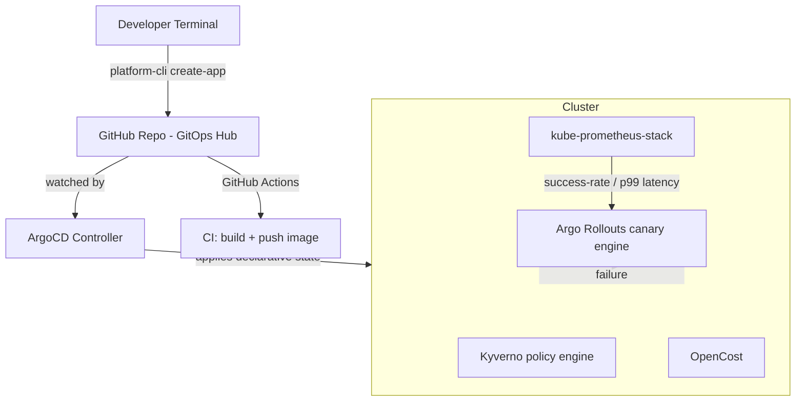

# GitOps Developer Platform

Extends the Adcash interview observability challenge into a full GitOps-driven internal developer
platform: Terraform-provisioned cluster and add-ons, ArgoCD for declarative
state, Argo Rollouts for metric-gated canary deployments, Kyverno for
policy-as-code, and OpenCost for per-namespace cost visibility — plus a
self-service CLI so a developer never hand-writes a Rollout spec.

## Architecture



## Repository layout

```
.
├── cli/                     # Self-service scaffolding CLI (platform-cli)
├── terraform/              # Cluster + platform add-ons (ArgoCD, Rollouts, Kyverno, Prometheus, OpenCost)
├── gitops/                 # App-of-Apps root, tenant Applications, Kyverno policies
├── apps/order-service/     # Rollout, AnalysisTemplate, and Helm chart wrapping both
├── observability/          # Dashboards-as-code, alert rules
└── scripts/                # Canary failure simulation
```

## Why an AnalysisTemplate, not just a Deployment

A plain `Deployment` rollout has no idea whether the new version is
actually healthy; it just replaces pods. The `AnalysisTemplate`
(`apps/order-service/analysis-template.yaml`) queries Prometheus every 30s
during the canary window and checks two SLIs against the same request
metrics the observability stack already collects:

| Metric | Gate | Failure limit |
|---|---|---|
| Success rate | ≥ 99.5% | 3 consecutive misses -> abort + rollback |
| p99 latency | ≤ 300ms | 3 consecutive misses -> abort + rollback |

Traffic shifts 10% -> 50% -> 100%, pausing 2m and 5m respectively so the
analysis has real data to evaluate at each step before committing more
traffic to the new version.

**Gotcha worth knowing (and mentioning in an interview):** the Helm chart
version of the AnalysisTemplate has to escape Argo's own `{{ args.* }}`
templating so Helm doesn't try to resolve it first — see the
`{{ "{{" }} ... {{ "}}" }}` trick in
`apps/order-service/helm/templates/analysis.yaml`. Two templating
engines touching the same file is a real thing you hit doing GitOps at
scale, not a contrived example.

## Governance and cost

- **Kyverno** (`gitops/system-addons/kyverno-policies.yaml`) enforces
  resource requests/limits on every pod and blocks `:latest` image tags —
  cluster-wide, before anything reaches ArgoCD's sync.
- **OpenCost** attributes spend per namespace so the `staging` tenant's
  actual compute cost is visible, not just its resource quota.

## Running it locally

```bash
# 1. Local cluster
kind create cluster --name adcash-idp

# 2. Provision platform add-ons
cd terraform
terraform init
terraform apply

# 3. Bootstrap GitOps (ArgoCD reconciles everything else from here)
kubectl apply -f ../gitops/bootstrap/app-of-apps.yaml

# 4. Scaffold a new service without touching YAML by hand
cd ../cli
pip install -r requirements.txt
python3 main.py create-app --name payments-service --image ghcr.io/anirudhbabu/payments-service:v1.0.0
```

## Proving the canary actually works (the demo that matters)

```bash
./scripts/simulate_canary_failure.sh --watch
```

This ships a build that returns HTTP 500 on ~10% of requests. Expected
sequence:
1. Rollout shifts 10% of traffic to the new pods
2. AnalysisTemplate starts failing the success-rate check every 30s
3. After 3 consecutive failures, Argo Rollouts **automatically aborts and
   rolls back** — no human paged, no manual `kubectl rollout undo`

## Portfolio capture checklist

- [ ] ArgoCD UI: App-of-Apps tree showing `adcash-idp-root` -> `order-service`
- [ ] `kubectl argo rollouts get rollout order-service -n staging` mid-abort,
      showing the degraded canary and automatic rollback
- [ ] Grafana `idp-canary-cost` dashboard: success rate dipping below the
      99.5% gate at the same moment the rollout aborts
- [ ] OpenCost namespace cost panel
- [ ] A GIF of `platform-cli create-app` running end-to-end, followed by
      ArgoCD picking up the new Application automatically

## What this demonstrates

- GitOps as the single source of cluster truth (ArgoCD, App-of-Apps pattern)
- Metric-gated progressive delivery instead of blind rolling updates
  (Argo Rollouts + Prometheus AnalysisTemplate)
- Policy-as-code guardrails enforced at admission time (Kyverno)
- Cost as a first-class platform signal, not an after-the-fact spreadsheet
  (OpenCost)
- Reducing developer cognitive load with a self-service CLI instead of
  requiring raw manifest authorship — the actual point of an "internal
  developer platform"
